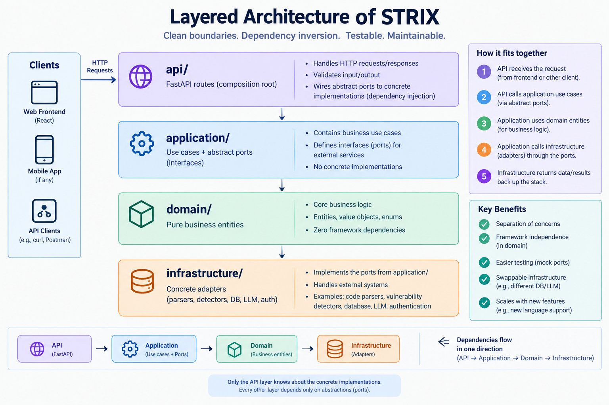

# STRIX — Explainable AI Code Intelligence Platform

**Every Algorithm Has a Story.**

STRIX analyzes your code and explains *how* it reached every conclusion — combining
deterministic static analysis (Python AST / Tree-sitter) with AI-generated natural-language
explanations. Built for DSA students, interview candidates, and developers who want to
understand *why* their code has the complexity it does — not just be told a number.

🔗 **Live app:** [strix-neon.vercel.app](https://strix-neon.vercel.app)
🔗 **API docs:** [strix-ahyr.onrender.com/docs](https://strix-ahyr.onrender.com/docs)

> Note: the backend is on Render's free tier, so the first request after inactivity may
> take 30–60 seconds to wake up.

---

## Why STRIX is different

Most AI coding tools guess. STRIX doesn't.

Every complexity estimate and algorithm match carries a **confidence level**
(high / medium / low) and a **plain-language rationale**. When the static engine genuinely
can't tell something — a nested loop is too deep for exact classification, or a function
delegates to a language built-in — STRIX says so honestly instead of fabricating a
confident-sounding answer. The AI layer only *narrates* facts the deterministic engine
already established; it never overrides them.

## Features

-  **Multi-language static analysis** — Python, C++, and Java, via Python's `ast` module
  and Tree-sitter
-  **Algorithm pattern detection** — Bubble Sort, Binary Search, Two Pointer, Two Sum
  (Brute Force), Duplicate Check (Brute Force) — across all three languages
-  **Time & space complexity estimation** — with confidence-scored reasoning, not just a
  label
-  **AI Reasoning Timeline** — a step-by-step trace of how STRIX reached its conclusion
-  **Optimization suggestions** — proposes a genuinely better approach when one is known
  (e.g. Bubble Sort → built-in sort, brute-force Two Sum → hash map), with a before/after
  complexity comparison
-  **Complexity graph** — visualizes where your code sits on the O(1) → O(n!) scale
-  **Algorithm visualizations** — animated step-through of the detected pattern
-  **Google OAuth** — sign in to save and revisit past analyses
-  **Analysis history** — pin/favorite and rename past runs for quick access
-  **PDF export** — download a clean report of any analysis
-  **Pluggable LLM layer** — Ollama for local dev, with automatic graceful fallback to a
  deterministic template explainer (used in production)

## Architecture

Backend follows Clean Architecture:



Frontend follows feature-sliced design (`features/landing`, `features/analysis`,
`features/auth`, `features/history`).

Every engine — parser, algorithm detector, complexity estimator, LLM explainer — is built
behind an abstract interface (port), so languages and providers are swappable without
touching business logic. Adding C++ and Java support, for example, meant writing new
adapters; the orchestration logic never changed.

## Tech stack

**Backend:** FastAPI · SQLAlchemy · Alembic · Python `ast` + Tree-sitter (C++/Java) ·
Authlib (Google OAuth) · Ollama (optional local LLM) with automatic fallback

**Frontend:** React · TypeScript · Tailwind CSS · Framer Motion · Monaco Editor ·
TanStack Query

**Database:** Neon Postgres (serverless)

**Deployment:** Render (backend) · Vercel (frontend)

**Testing:** pytest — 100+ tests covering parsers, detectors, complexity estimation,
optimization suggestions, auth, and persistence across all three supported languages

## Running locally

**Backend:**
```bash
cd backend
python -m venv .venv
.venv\Scripts\activate        # Windows
# source .venv/bin/activate   # macOS/Linux
pip install -r requirements-dev.txt
cp .env.example .env          # fill in your own values
alembic upgrade head
uvicorn app.main:app --reload
```

**Frontend:**
```bash
cd frontend
npm install
cp .env.example .env
npm run dev
```

Visit `http://localhost:5173`.

## Testing

```bash
cd backend
pytest -v
```

## Project status

Actively developed. Currently detects 5 algorithm patterns across Python/C++/Java.
Planned next: more pattern coverage (Merge Sort, DFS/BFS, Sliding Window), best/average/
worst-case complexity differentiation, and Benchmark Mode.

---

Built by **Namrata Singh**.